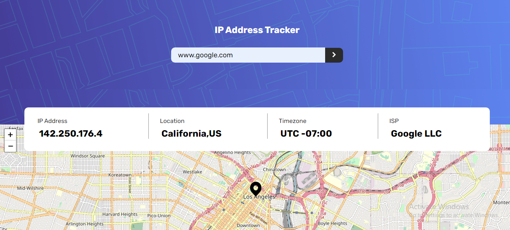

# Frontend Mentor - IP address tracker solution

This is a solution to the [IP address tracker challenge on Frontend Mentor](https://www.frontendmentor.io/challenges/ip-address-tracker-I8-0yYAH0). Frontend Mentor challenges help you improve your coding skills by building realistic projects. 

## Table of contents

- [Overview](#overview)
  - [The challenge](#the-challenge)
  - [Screenshot](#screenshot)
  - [Links](#links)
- [My process](#my-process)
  - [Built with](#built-with)
  - [What I learned](#what-i-learned)
  - [Continued development](#continued-development)
  - [Useful resources](#useful-resources)
- [Author](#author)

## Overview

### The challenge

Users should be able to:

- View the optimal layout for each page depending on their device's screen size
- See hover states for all interactive elements on the page
- See their own IP address on the map on the initial page load
- Search for any IP addresses or domains and see the key information and location

### Screenshot

### Links

- Solution URL: [Github Repo](https://github.com/obinneji/ip-tracker-app)
- Live Site URL: [Ip-Tracker App](https://ip-tracker-apps.vercel.app)

## My process

### Built with

- Semantic HTML5 markup
- CSS custom properties
- Flexbox
- Javascript
- leaflet.js

### What I learned

- Usage of leaflet maps and geo location Api.
- DOM manipulation in Javascript.

### Continued development

I will continue development as i will provide a store for previously stored ip address or domain.

### Useful resources

- [Leaflet Documentation](https://leafletjs.com/) - This helped me for rendering the map. 
- [Leaflet Github page](https://github.com/Leaflet) - This is an issue section helped me fix a box on map re-rendering. I'd recommend it to anyone still learning this concept.

## Author

- Website - [Obinneji Chibuzor](https://obinnejichibuzor.vercel.app)
- Frontend Mentor - [@obinneji](https://www.frontendmentor.io/profile/obinneji)
- Twitter - [@francisobinneji](https://www.twitter.com/francisobinneji)

